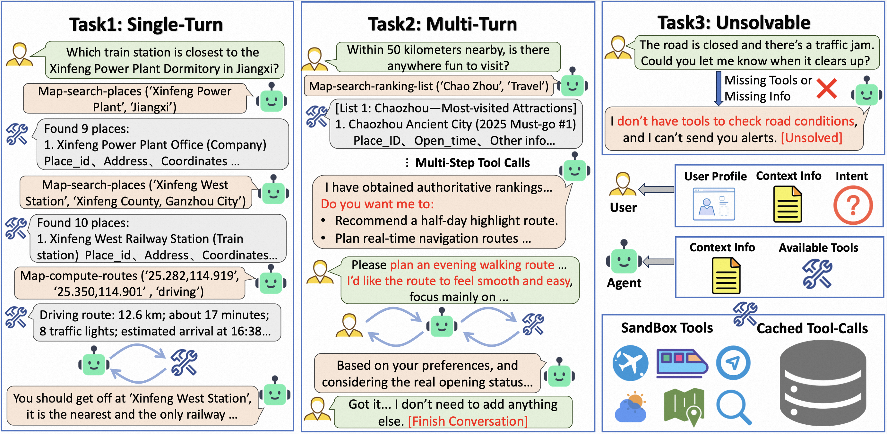
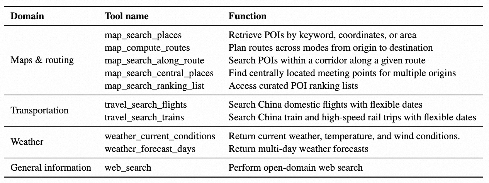

# Beyond Itinerary Planning—A Real-World Benchmark for Multi-Turn and Tool-Using Travel Tasks

🎉 **This paper has been accepted to ACL 2026 Main Conference!** [[arXiv]](https://arxiv.org/abs/2512.22673)

## 🌟 Introduction

**TravelBench** is a benchmark designed for **truly real-world** travel planning evaluation.

<div align="center">
<br>
<em>Figure 1: An overview of TravelBench</em>
</div>

### What We Provide

- **Real-World Data**: User queries, user preferences, and tools collected from real scenarios
- **Sandbox Environment**: 10 cached real tool-call results for stable invocation and reproducible evaluation
- **Comprehensive Tool Library**: Ten travel-related tools that agents can combine to solve practical travel planning problems

<div align="center">
<br>
<em>Figure 2: Ten real-world tools supported in TravelBench</em>
</div>

### Three Subtasks

We construct three subtasks to evaluate agents' core capabilities in real settings:

| Subtask               | Capability Evaluated                                                     |
| --------------------- | ------------------------------------------------------------------------ |
| **Single-Turn** | Solving problems autonomously                                            |
| **Multi-Turn**  | Interacting with users to elicit implicit preferences from user profiles |
| **Unsolvable**  | Recognizing capability boundaries                                        |

## 📋 Table of Contents

- [Installation](#-installation)
- [Quick Start](#-quick-start)
- [Detailed Usage](#-detailed-usage)
  - [Model Deployment](#1-model-deployment)
  - [Precompute Embeddings](#2-precompute-embeddings)
  - [Run Inference](#3-run-inference)
  - [Run Evaluation](#4-run-evaluation)
- [Utilities](#-utilities)
- [License](#-license)

## 🔧 Installation

### Prerequisites

- Python 3.10+
- Conda (recommended)

### Setup

```bash

# Create and activate conda environment
conda create -n travelbench python=3.10
conda activate travelbench

# Install dependencies
pip install -r requirements.txt

# Extract the sandbox cache archive
unzip sandbox_cache.zip
```

## 🚀 Quick Start

Below is a quick start guide. For more detailed usage, please refer to [Detailed Usage](#-detailed-usage).

```bash
# 1. Deploy models
source scripts/base_config.sh
source scripts/vllm_server.sh 
source scripts/vllm_embedding_server.sh 

# 2. Precompute embeddings
python -m travelbench.simulators.precompute_embeddings

# 3. Run inference
bash scripts/infer.sh

# 4. Run evaluation
bash scripts/eval.sh
```

## 📖 Detailed Usage

### 1. Model Deployment

First, configure the model information and OpenAI-style API endpoint and key in `scripts/base_config.sh`.

> **Important**: User simulation and tool simulation require `gpt4.1-0414-global`, evaluation requires `gemini-3-flash-preview`, Please ensure your configured `api_base` and `api_key` support these models.
> Embedding model requires `qwen3-embedding-8b`.

#### Option 1: Local Deployment (Recommended)

By default, all deployed models support native tool calling. You can configure whether to enable thinking mode in `base_config.sh`.

The following scripts will automatically deploy models and set environment variables:

```bash
source scripts/base_config.sh  # Setting environment variables
source scripts/vllm_server.sh  # Deploy agent model
source scripts/vllm_embedding_server.sh   # Deploy embedding model
```

> **Note**: Deployment logs can be found in the `logs/` directory.

#### Option 2: Remote Deployment

If you deploy models on a remote server, set the environment variables manually:

```bash
export EMBEDDING_SERVICE_URL="Your embedding service URL"
export EMBEDDING_MODEL_NAME="Your embedding model name"
export MODEL_SERVICE_URL="Your model service URL"
export MODEL_NAME="Your model name"
```

Once model deployment is complete, proceed to the next step.

### 2. Precompute Embeddings

> **Note**: Embedding precomputation requires `qwen3-embedding-8b`. Please ensure your embedding service is properly configured.

Before running inference, precompute embeddings for cached data. This step only needs to be run once:

```bash
python -m travelbench.simulators.precompute_embeddings
```

### 3. Run Inference

> **Note**: User simulation and tool simulation require `gpt4.1-0414-global`.

First, modify the relevant configurations in `infer.sh`:

- **`AGENT_LLM`**: The model to be evaluated. Defaults to the environment variable `MODEL_NAME`.
- **`USE_CUSTOM_ENDPOINT`**: Set to `true` to use the locally deployed model address (`MODEL_SERVICE_URL`); otherwise, the default `OPENAI_API_BASE` will be used.
- **`BASE_OUTPUT_PATH`**: Path to save inference records (default: `./output`)
- **`max-concurrency`**: Number of concurrent evaluation tasks

#### Custom Model Configuration

You can override environment variables by specifying custom configurations:

```json
{
  "max_tokens": 8192,
  "temperature": 0.7,
  "api_base": "your api base",
  "api_key": "your api key",
  "enable_thinking": true // useful for thinking model
}
```

Assign the configuration string to `AGENT_LLM_ARGS`, `USER_LLM_ARGS`, or `TOOL_LLM_ARGS`. For example:

```bash
TOOL_LLM_ARGS="{\"max_tokens\": 8192, \"temperature\": 0.0, \"api_base\": \"your api base\", \"api_key\": \"your api key\"}"
```

> **Note**: Custom configurations will override environment variables. If not specified, environment variables will be used by default.

Run inference in the background:

```bash
mkdir Logs
nohup bash scripts/infer.sh > Logs/infer.log 2>&1 &
```

### 4. Run Evaluation

> **Note**: Evaluation requires `gemini-3-flash-preview`.

First, configure the following parameters in `scripts/eval.sh`:

- **`INPUT_DIR`**: Path to inference records (generated by `infer.sh`)
- **`BASE_OUTPUT_DIR`**: Path to save evaluation results (default: `./eval_output`)
- **`JUDGE_MODEL`**: Model used for evaluation (default: `gemini-3-flash-preview`)
- **`JUDGE_API_KEY` / `JUDGE_API_BASE`**: API configuration (default: uses `OPENAI_API_BASE` and `OPENAI_API_KEY` environment variables)
- **`max-concurrency`**: Number of concurrent evaluation tasks

Run evaluation in the background:

```bash
nohup bash scripts/eval.sh > Logs/eval.log 2>&1 &
```

## 🛠️ Utilities

View cache data and available tools:

```bash
# List all cached data
python -m travelbench status

# List all available tools
python -m travelbench tools
```

## 📄 License

This code is licensed under the [MIT License](https://opensource.org/license/mit) - see the [LICENSE](./LICENSE) file for details.

The dataset is licensed under the [Creative Commons Attribution-NonCommercial 4.0 International License (CC BY-NC 4.0)](https://creativecommons.org/licenses/by-nc/4.0/) - see the [LICENSE](./datas/LICENSE) file for details.

## 📖 Citation

If you find our paper and resources useful, please consider citing our paper:

```bibtex
@article{cheng2025travelbench,
  title={TravelBench: A Real-World Benchmark for Multi-Turn and Tool-Augmented Travel Planning},
  author={Cheng, Xiang and Hu, Yulan and Zhang, Xiangwen and Xu, Lu and Pan, Zheng and Li, Xin and Liu, Yong},
  journal={arXiv preprint arXiv:2512.22673},
  year={2025}
}
```
